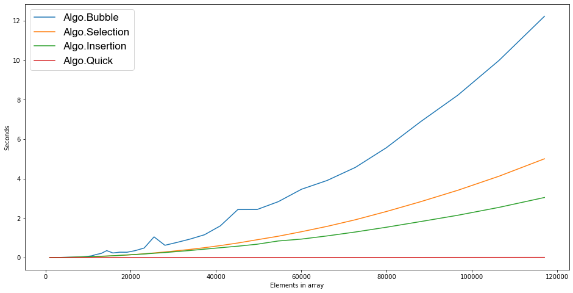

# Big O and timing analysis of sorting algorithms

The time complexity of 4 differernt sorting algorithms is listed below along with a graph of the time it takes to sort an array as the number of elements in that array increases. 

- Bubble Sort is $O(n^2)$ and this is a result of the nested for loop inside of the algorithm

- Selection Sort is $O(n^2)$ and is a result of for loops inside of a while loop but the perfomance of this algorithm is better than that of Bubble Sort. 

- Insertion Sort is also $O(n^2)$ because of the nested for loops in the algorithm but this algorithm is more efficient than both Selection and Bubble Sort. 

- QuickSort has a time complexity of $O(n*log\ n)$ and is much more efficient than the other sorting algorithms.

The average time to run each of these algorithms can be seen in the table below. 
| Algorithm     |  Average Time (s)|
|---------------|----------|
| Bubble        | 1.429713 |
| Selection     | 0.564492 |
| Insertion     | 0.389414 |
| Quick         | 0.002406 |

